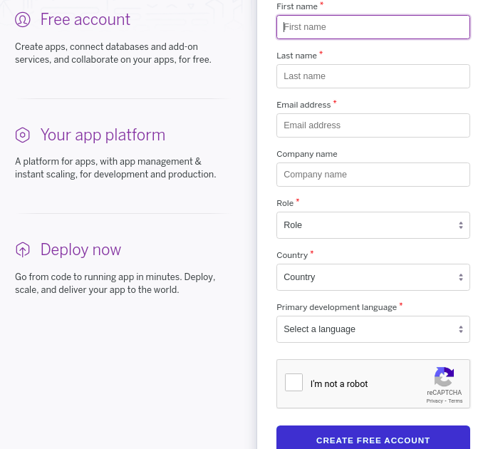
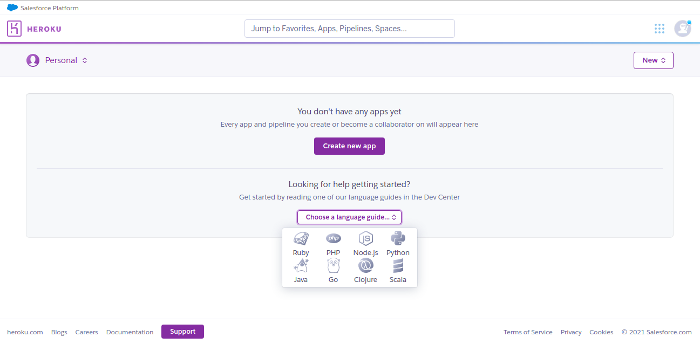
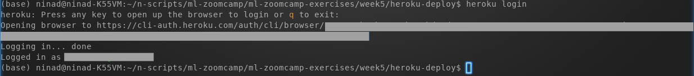

### How to use Heroku to host your python web app for free

<a id='toc'></a>
<a id='toc'></a>
## Table of Contents
- [Table of Contents](#table-of-contents)
  - [1. Background:](#1-background)
  - [2. Preparation](#2-preparation)
    - [2.1 Create account in Heroku](#21-create-account-in-heroku)
    - [2.2. Install Heroku command line interface (cli) on your machine](#22-install-heroku-command-line-interface-cli-on-your-machine)
  - [3. Deploy your Web app to Heroku](#3-deploy-your-web-app-to-heroku)
    - [3.1 Deploy as a docker container to Heroku](#31-deploy-as-a-docker-container-to-heroku)
    - [3.2 Deploy without docker container to Heroku](#32-deploy-without-docker-container-to-heroku)

----

<a id='background'></a>
[back to TOC](#toc)
### 1. Background:
In the Machine Learning Zoomcamp course conducted by Alexey Grigorev (https://github.com/alexeygrigorev/mlbookcamp-code/tree/master/course-zoomcamp) in Week/Session #5, it is required to deploy a web service which can accept user provided customer data and using a trained ML model, predict whether the customer will churn or not.

For this, participants can either deploy the web service locally on their machine, inside a docker container on their machine, or in Cloud (AWS, Azure. Google etc.).

There was one more option that was suggested, which is to use Heroku to host python based web application for free. This option will especially be useful when working on the Project 1 as part of this course, and hence I thought of exploring this option and preparing this reference for others to follow if they wish to use this option.

Following are the steps to use Heroku. These have been explained with an example web app that was used for the homework of week5 of the course.

*Thanks to Harshit for his video https://www.youtube.com/watch?v=1Z7nt0Fyits from where I learned the steps, and then some more reading from Heroku documentation.*

----
<a id='preparation'></a>
[back to TOC](#toc)
### 2. Preparation
#### 2.1 Create account in Heroku

Go to https://www.heroku.com/ and Signup




You can also setup Google authenticator app on your mobile to get a token (OTP) and use it for Multi-factor authentication when logging in to Heroku.

Once logged in, you can deploy web app in any of the languages - Python, Ruby, PHP, Node.js, Java, Go, Closure, Scala



#### 2.2. Install Heroku command line interface (cli) on your machine

There are multiple ways to deploy a web app on Heroku (via the Heroku Dashboard, using CLI from your machine), of which I used the CLI option.

There are multiple options availabe to install Heroku cli - which can be found here - https://devcenter.heroku.com/articles/heroku-cli. 

**c. Add heroku/bin to your PATH**

To add the heroku/bin path on a Linux machine, execute the below command. For Windows refer to https://helpdeskgeek.com/windows-10/add-windows-path-environment-variable/


----
[back to TOC](#toc)
<a id='deploy-app'></a>
### 3. Deploy your Web app to Heroku
When using Heroku, you can deploy your Web app as a docker container to heroku, or you can deploy it without using docker. Following section explains both these options.

[back to TOC](#toc)
<a id='deploy-app-docker'></a>
#### 3.1 Deploy as a docker container to Heroku

To be able to deploy to Heroku as a docker container, you need to first have docker installed and running. For this, you have 2 options:
* 1. Use docker installed on your local machine
* 2. Use Google Cloud shell which has docker pre-installed. Google Cloud shell provides a free machine if you have a Gmail account. 

Steps to deploy your app to heroku as a docker container are explained below (including the slight difference for the 2 options mentioned above)

**a. Prepare code base for docker deployment**

Create a directory for your deployment and copy your code for the Web app, any ML model files (if/as appropriate), python package dependencies (this example shows use of pipenv and hence Pipfile and Pipfile.lock, however you can requirements.txt or files as applicable for you).

> If you are using Google Cloud shell refer to guide in this [link](./how-to-use-google-cloud-shell-for-docker.md) to understand how to upload your files to Google Cloud shell


**b. Create Dockerfile**

Create Dockerfile (filename should be exactly this) in the same directory with appropriate lines for your docker image.

Below example shows, python:3.8.12-slim being used as base image, installing pipenv, then copying the Pipfile and Pipfile.lock that specify python dependency packages, installing the dependency packages using pipenv, then copying the python code for the web app, followed by defining port to be exposed and entrypoint command that should get run when docker container starts.

**Note:** One very important point I struggled and understood after a long time is that you cannot map to a custom port in Heroku. Thus, for gunicorn, do not use anything like 

```ENTRYPOINT ["gunicorn", "--bind=0.0.0.0:9696", "sample_app:app"]```

but something like

```ENTRYPOINT ["gunicorn", "sample_app:app"]```

Although using the first syntax worked when running docker container locally on my machine, it failed when deployed to Heroku - hence suggesting the second syntax. Will try to investigate further and update once I know better.


**c. Deploy to Heroku as docker container**

Run the following steps in sequence to deploy your web app as a docker container to Heroku.

If you are executing these steps from your local machine then follow steps in [Option A](#option-a) below. However if you are executing these steps from Google Cloud shell, then follow steps in [Option B](#option-b) below. The difference is due to the fact that the step to login from your local machine will open a web browser where you can login to Heroku providing credentials. Whereas from Google Cloud shell, the web browser tab cannot be opened for you to login. Hence for the Google Cloud shell scenario, we will use API key from Heroku. 

<a id='option-a'></a>
**Option A: Login to heroku from your machine** : Verify heroku command is found (In step 2.2.c. above the path has already been set) in the path. Then using heroku cli, login to heroku.  Press any key when asked to do so.

```which heroku```

```heroku login```


  
This will open a tab in your web browser asking you to login to Heroku. Login to Heroku.


Now you can close this tab and return to the command prompt on your terminal
  


You can skip Option B below and continue with steps provided in [Login to Heroku container](#login-heroku-container)

<a id='option-b'></a>
**Option B: Login to heroku from Google Cloud shell**  : 
(removed)

<a id='login-heroku-container'></a>
**Login to Heroku container**  : Login to Heroku container registry.

```heroku container:login```


**Create app in Heroku**: Create an app in Heroku. Below example shows creating a app with the name ml-zoom-docker.

```heroku create ml-zoom-docker```


**Push docker image to Heroku**: Push docker image to Heroku container registry. When you run the below command, the Dockerfile will be used to build the docker image locally on your machine and then push the image to Heroku container registry. Using the -a flag you specify the application name (e.g. ml-zoom-docker app that you created above).

```heroku container:push web -a ml-zoom-docker```


**Release container**: Deploy container on Heroku. When you run the below command, a docker container will be launched in Heroku from the docker image that you pushed to Heroku container registry.

```heroku container:release web -a ml-zoom-docker```


**Launch you app**: Open your web app. For this you can go your web browser and open your application URL with appropriate path (e.g. my sample application would run at https://ml-zoom-docker.herokuapp.com/welcome - since ml-zoom-docker is the name of my app and I am serving page /welcome via my sample app)


**Great !!!** You web app is now running in Heroku as a docker container !!!

---

[back to TOC](#toc)
<a id='deploy-app-nodocker'></a>
#### 3.2 Deploy without docker container to Heroku
(removed)